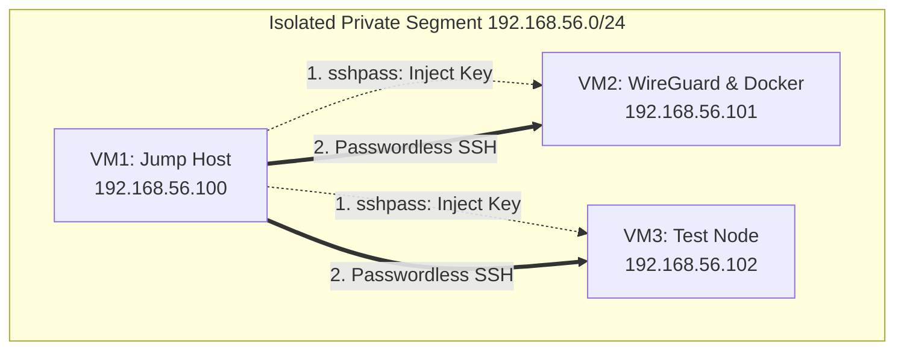
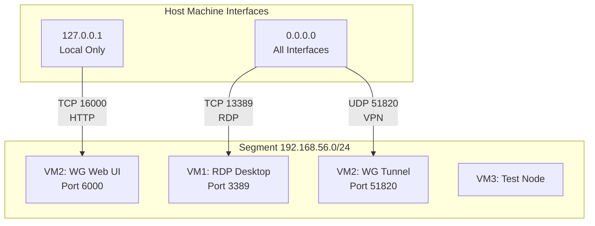

<div align="center">


[](https://www.vagrantup.com/)
[](https://www.docker.com/)
[](https://www.virtualbox.org/)
[](https://www.ssh.com/academy/ssh/protocol)
[](https://www.gnu.org/software/bash/)
[](https://releases.ubuntu.com/jammy/)
[](https://www.wireguard.com/)

**Infrastructure as Code (IaC) project demonstrating automated deployment of a secure,<br>
three-node network cluster with WireGuard VPN and Zero-Touch SSH configuration.**

<p align="center">
  <kbd><a href="#-architecture-of-virtual-machines--%EF%B8%8F-key-features-of-automation">Architecture</a></kbd> •
  <kbd><a href="#-1-zero-touch-ssh-provisioning-автоматическая-настройка-доступа">SSH Automation</a></kbd> •
  <kbd><a href="#-3-wireguard-vpn--docker-host-vm2">WireGuard & Docker</a></kbd> •
  <kbd><a href="#-требования-и-запуск">Quick Start</a></kbd>
</p>
</div>
</br>

---

Этот репозиторий содержит код для автоматического развертывания безопасной сетевой инфраструктуры из трех узлов. Проект построен по принципу **IaC (Infrastructure as Code)**.

Проект демонстрирует продвинутые навыки работы с **Bash-скриптами**, **настройкой сетей**, **Linux настройка безопасности (Security)** и **автоматизацией рутинных задач**, таких как автоматическая установка SSH-ключей без участия человека.


## 🏗 Architecture of virtual machines & ⚡️ Key features of automation

Стенд состоит из трех виртуальных машин (Ubuntu 22.04), объединенных в приватную сеть `192.168.56.0/24`.

*Таблица 1. Роли и характеристики узлов инфраструктуры*

| Нода | Роль | Особенности |
| :--- | :--- | :--- |
| **VM1** | **Jump Host** | Точка входа. Desktop-окружение, XRDP, автоматический менеджер SSH-ключей. |
| **VM2** | **VPN & Docker** | Сервер WireGuard с Web UI и Docker Engine. |
| **VM3** | **Test Node** | Изолированный узел для проверки политик доступа и SSH. |

### 🔑 1. Zero-Touch SSH Provisioning (Автоматическая настройка доступа)

В стандартной конфигурации Vagrant виртуальные машины изолированы и не доверяют друг другу. Чтобы объединить их в единый контур управления без ручного копирования ключей, реализован сценарий, где **VM1 выступает в роли управляющего узла (Control Node)**.

**Алгоритм работы провижининга:**

1. **Hardening Pre-check:** На этапе старта на всех машинах применяются базовые настройки безопасности (см. **Таблицу 2**), но временно разрешается `PasswordAuthentication` для первичной настройки.
2. **Key Generation:** VM1 (Jump Host) генерирует пару ключей `Ed25519`.
3. **Host Discovery:** VM1 сканирует сеть, собирает отпечатки (fingerprints) соседей с помощью `ssh-keyscan` и добавляет их в `known_hosts`, предотвращая интерактивные вопросы о доверии при первом подключении.
4. **Trust Injection:** Используя утилиту `sshpass` и временные пароли, VM1 внедряет свой публичный ключ в `authorized_keys` на VM2 и VM3.
5. **Security Lockdown:** Сразу после проверки доступа по ключу, VM1 удаленно выполняет команды на соседних узлах для **полного отключения аутентификации по паролю**. В завершении VM1 отключает вход по паролю и у себя.

**Итог:** Вы получаете готовую инфраструктуру, где управление происходит с VM1 по защищенным ключам, а возможность `PasswordAuthentication` отключена.

*Таблица 2. SSH Security Hardening (Конфигурация `/etc/ssh/sshd_config`)*

| Параметр | Значение | Описание |
| --- | --- | --- |
| **Protocol** | `2` | Принудительное использование второй версии протокола (отсекаем SSH-1). |
| **PermitRootLogin** | `no` | Полный запрет входа под root-пользователем. |
| **PasswordAuthentication** | `no` | Вход только по SSH-ключам (отключается после провижининга). |
| **MaxAuthTries** | `2` | Жесткий лимит попыток аутентификации для защиты от брутфорса. |
| **LoginGraceTime** | `10s` | Обрыв соединения, если пользователь не авторизовался за 10 секунд. |
| **MaxSessions** | `2` | Ограничение количества одновременных SSH-сессий. |
| **PermitEmptyPasswords** | `no` | Запрет пустых паролей. |
| **HostbasedAuthentication** | `no` | Отключение менее защищенных методов проверки подлинности хостов. |




*Рис. 1. Алгоритм распределения SSH-ключей и установления доверительных отношений между узлами сети.*

### 🖥 2. Jump Host с GUI (VM1)

* Развернут `ubuntu-desktop-minimal`.
* Настроен **XRDP** для удаленного доступа с хостовой машины.
* Добавлен `xrdp` в группу `ssl-cert` для корректной работы ключей шифрования.
* Локальный DNS настроен через `/etc/hosts` для прозрачного обращения к нодам по именам (`ssh ubuntu@vm2`,`ssh ubuntu@vm3`).

### 🐳 3. WireGuard VPN & Docker Host (VM2)

* Автоматическая установка **Docker Engine** через официальный репозиторий с добавлением GPG-ключей.
* Развертывание WireGuard сервера и подтягивание последнего релиза [WireGuard UI](https://github.com/ngoduykhanh/wireguard-ui) через GitHub API.
* **Watchdog-автоматизация**: Настроены системные юниты `systemd.path` и `systemd.service`. При любом изменении конфигурации VPN через веб-админку, триггер автоматически перезапускает туннель `wg-quick@wg0`.

### 👤 4. Управление пользователями (VM3)

* Автоматическое создание пользователя `adam` с домашней директорией и оболочкой bash.
* Настройка `passwordless sudo` через конфигурацию drop-in файлов в `/etc/sudoers.d/` с корректными правами (440).


### 🔌 5. Connectivity & Access Points (Точки входа)

* **Jump Host (VM1):** Доступен по RDP через `[Host_IP]:13389`. Биндинг на `0.0.0.0` позволяет заходить в графическое окружение лабы с любого устройства в вашей локальной сети.
* **VPN Tunnel (VM2):** Порт `51820/UDP` открыт на `0.0.0.0` для подключения внешних WireGuard-клиентов.
* **WireGuard Web UI:** `http://127.0.0.1:16000`.
* *Security Note:* Панель управления намеренно забинжена на `127.0.0.1` хост-машины. Это гарантирует, что незашифрованный HTTP-трафик админки не покидает ваш компьютер и недоступен извне.




*Рис. 2. Схема сетевого взаимодействия и трансляции портов (Port Forwarding) между хост-системой и виртуальным контуром.*


---

## 🚀 Требования и Запуск

> **Важно:** Данный проект жестко оптимизирован под провайдер **VirtualBox**. Использование других провайдеров (Hyper-V, VMware, Libvirt) потребует переработки логики сетевых интерфейсов (`private_network`) и механизмов проброса портов.

* **Провайдер:** VirtualBox (тестировалось на 7.2.4).
* **Инструмент:** Vagrant (2.4.9).
* **ОС:** Базовый образ — официальный [ubuntu/jammy64](https://portal.cloud.hashicorp.com/vagrant/discover/ubuntu/jammy64) от Canonical.

> 🪟 **Внимание для пользователей Windows (Hyper-V Conflict):**
> Если в системе включен компонент Hyper-V, связка Vagrant + VirtualBox будет работать нестабильно (чаще всего это приводит к таймаутам при попытке Vagrant подключиться к машине по SSH). 
> 
> Проверить статус гипервизора можно в `cmd` или `PowerShell`:
> ```cmd
> systeminfo | findstr /i hyper
> ```

**Запуск:**

1. **Клонируйте репозиторий:**
```bash
git clone https://github.com/mascotmascot1/vagrant-wireguard-iac-lab.git
cd vagrant-wireguard-iac-lab

```

2. **Настройте сеть:** Отредактируйте переменную `$public_ip` в `Vagrantfile`, чтобы она соответствовала вашей локальной подсети (например, `192.168.1.100`).
3. **Поднимите стенд:**
```bash
vagrant up

```

---

## 🧪 Проверка работоспособности (Verification)

Чтобы убедиться, что автоматизация отработала корректно, выполните следующие шаги:

1. **Подключитесь к VM1:**
```bash
vagrant ssh vm1

```

2. **Переключитесь на пользователя `ubuntu**` (именно для него сгенерированы ключи):
```bash
sudo su - ubuntu

```


3. **Проверьте беспарольный доступ к соседним узлам:**
```bash
ssh vm2  # Вход должен произойти мгновенно без запроса пароля

```


4. **Проверьте статус службы docker и сетевого интерфейса wireguard на VM2:**
```bash
sudo wg show
sudo systemctl status wg-quick@wg0
sudo systemctl status docker
```

---

## ⚠️ Важное примечание

Этот проект создан для **образовательных и лабораторных целей**.

* Веб-интерфейс работает по протоколу HTTP.
* В коде используются демонстрационные пароли.
**Не используйте данную конфигурацию в публичных сетях без настройки TLS и смены секретов!**

---

## 📜 Лицензия

Этот проект распространяется по лицензии **MIT**.  
Подробности см. в файле [`LICENSE`](./LICENSE).
